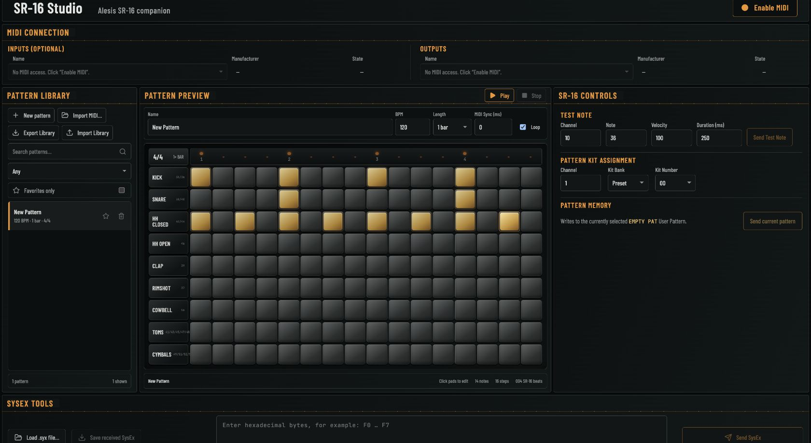

# SR-16 Studio

SR-16 Studio is a static browser-based MIDI companion for the Alesis SR-16 drum machine. It provides a local MIDI-pattern library, automatic one/two-bar detection, direct SR-16 MIDI pattern preview, and guarded writes to an empty SR-16 User Pattern.

[Open SR-16 Studio](https://deladriere.github.io/SR-16-Studio/)



## Requirements

- Desktop Chrome or Edge with Web MIDI support
- A MIDI interface for physical SR-16 testing
- Node.js 20 or newer and pnpm (via Corepack) for development
- HTTPS in production, or `http://localhost` during development

Web MIDI and especially SysEx are secure-context browser features. Opening `index.html` directly with `file://` is not supported. MIDI permission is requested only when **Enable MIDI** is clicked.

## Wiring

```text
Computer MIDI OUT  --->  SR-16 MIDI IN

SR-16 MIDI OUT  --->  Computer MIDI IN
```

The second cable is optional. Output-only mode supports test notes, Program Change, pattern preview, and sending SysEx. Connect the SR-16's MIDI OUT when you want to receive and save SysEx data from the device—useful for inspecting real device messages and informing future development, such as a safe read-only memory browser. A MIDI input is required only for inbound monitoring, receiving SysEx, and future backup/restore workflows.

## Install and develop

```bash
corepack enable
pnpm install --frozen-lockfile
pnpm dev
```

Open the localhost address shown by Vite, then click **Enable MIDI**. The application never requests MIDI permission automatically.

## Test and build

```bash
pnpm test:run
pnpm build
pnpm preview
```

The Vite base path is relative, so the contents of `dist/` can be deployed beneath a GitHub Pages repository path. Pushes to `main` deploy through the included GitHub Actions workflow after GitHub Pages is enabled for the repository.

## Architecture

```text
src/
  components/       Shared panel and form primitives
  features/
    midi/            Connection, controls, and monitor UI
    patterns/        MIDI pattern library and step-sequencer preview
    sysex/           Generic SysEx load/edit/send/save UI
    settings/        Reserved feature boundary
  hooks/             React orchestration around services
  models/            MIDI, settings, and device-profile contracts
  services/
    midi/            All Web MIDI browser API access
    patterns/        MIDI parsing and timed preview playback
    storage/         Versioned settings and IndexedDB pattern storage
  utils/             MIDI formatting/decoding and SysEx validation
```

`MidiService` owns browser API calls, hot-plug handling, selected ports, input listeners, and all sends. React components consume snapshots and events; they do not touch `navigator.requestMIDIAccess` or `MIDIOutput` directly. The `DrumMachineProfile` abstraction isolates the documented capabilities of the Alesis SR-16 without inventing manufacturer-specific bytes.

## Features

- Explicit MIDI + SysEx permission request
- Web MIDI and SysEx capability detection
- Hot-plug device discovery and disconnection warnings
- Optional input selection and independent output selection
- Test Note and friendly User/Preset Drum Set 00–49 selection
- Incoming and outgoing MIDI monitor with pause, clear, decode, and bounded history
- Generic `.syx` load, hexadecimal validation/editing, send, receive, and download
- Persistent device preferences and test settings using localStorage
- Standard MIDI file import for one- and two-bar drum patterns (the current editor scope)
- Automatic one/two-bar detection with a manual correction control
- Local IndexedDB pattern library with search, BPM filtering, favorites, deletion, and JSON export/import backups
- New empty 1-bar Studio patterns can be created directly from the Pattern Library
- Editable pattern name in the Preview toolbar, persisted to the local library
- 16-step hardware-style sequencer view; two-bar patterns use 32 steps with horizontal scrolling
- Click-to-edit sequencer pads: empty pads add velocity-100 hits and active pads remove them without stopping playback
- SR-16 preview over the selected MIDI output using the configured test-note channel, with BPM and loop controls
- Look-ahead playback scheduling for gapless loop boundaries and lower browser-timer jitter
- Isolated full-step playhead synchronized by animation frames, with persistent MIDI visual-sync calibration
- Batched MIDI monitoring, bounded rendered history, and a larger hardware-MIDI scheduling buffer
- Persistent MIDI visual-sync calibration from -200 to +200 ms; positive values delay the cursor
- Local persistence only: imported files and metadata are not uploaded. The library belongs to the current browser profile and app address; clearing that site's browser data deletes it.
- **Export Library** downloads a versioned JSON backup of the parsed patterns and their edits. **Import Library** validates and merges that JSON file into the local library; patterns with matching IDs are updated and other local patterns remain. Original MIDI file binaries are not included.
- Guarded write of a compatible Studio pattern to the SR-16's currently selected empty User Pattern

## Known limitations

- Chrome and Edge desktop are the supported browsers.
- SysEx access depends on browser/OS permission and may be unavailable even when standard MIDI access succeeds.
- Browsers expose devices by the names supplied by the OS and MIDI driver.
- Input is optional, but inbound monitoring and received-SysEx download are unavailable without it.
- The test suite mocks formatting, validation, channel conversion, and persistence; it cannot emulate every OS MIDI driver behavior.
- The current editor and SR-16 pattern export support one- and two-bar 4/4 patterns. Longer Studio arrangements are planned, but a single SR-16 Pattern slot remains limited to two 4/4 bars.
- Pattern transfer is one User Pattern at a time. The app does not import, decode, or restore a full SR-16 memory dump; do not send full-memory dumps through this app.
- MIDI Clock, per-hit velocity editing, custom kit mappings, song arrangement, and backup/restore workflows are not implemented.
- MIDI import quantizes visible notes to a 16th-note grid for preview; the stored event timing is retained.
- The SR-16 MIDI notes are timestamp-scheduled, but the on-screen step highlight can still advance unevenly under browser/UI load; visual timing needs further work.

## What's next

- Read-only full-memory backup capture and browsing, so all User Patterns can be inspected without risking the SR-16's memory
- Carefully validated full-memory restore, kept separate from the read-only backup flow because it can overwrite the device's patterns, songs, drum sets, and settings
- Longer Studio arrangements, with future splitting into SR-16-sized patterns and Song arrangement support
- Custom kit mappings, MIDI Clock, and per-hit velocity editing

## Manual SR-16 hardware test

1. Wire computer MIDI OUT to SR-16 MIDI IN. Add SR-16 MIDI OUT to computer MIDI IN for receive tests.
2. Start the app on localhost or HTTPS in desktop Chrome/Edge.
3. Click **Enable MIDI** and grant MIDI/SysEx permission.
4. Select the interface output. Leave input blank to confirm output-only mode remains usable.
5. Set Channel 10, Note 36, Velocity 100, Duration 250 ms. Click **Send Test Note** and confirm the SR-16 plays the expected drum voice. Confirm Note On and Note Off appear as OUT rows.
6. Change Bank or Drum Set and confirm the SR-16 changes program only according to its documented MIDI configuration. The selection is sent immediately; there is no separate send button.
7. Load a known-safe `.syx` file, verify its hexadecimal display, and send it. Do not send unverified dumps to valuable SR-16 memory.
8. Select the interface input, transmit a SysEx dump from the SR-16, confirm an IN SysEx monitor row, then use **Save received SysEx** and compare the saved bytes.
9. Disconnect and reconnect the interface to verify the visible warning and device-list refresh.
10. Reload the page and verify selected device IDs and test settings are restored when those ports are still available.
11. Export the pattern library, import the JSON backup, and confirm its pattern count and edits are restored.

Physical sound output, actual kit selection semantics, Program Change behavior, driver naming, and real SysEx transfer cannot be validated without the drum machine and MIDI interface.

Built collaboratively with OpenAI Codex. Hardware behavior, product decisions, and SR-16 validation were directed and tested by the project author.
